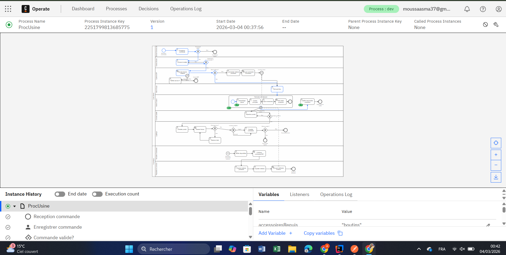
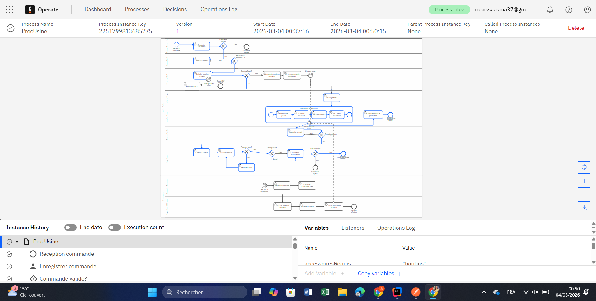
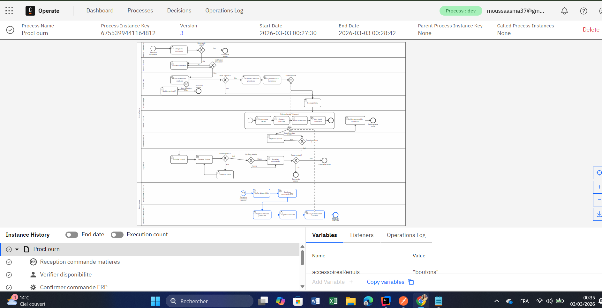
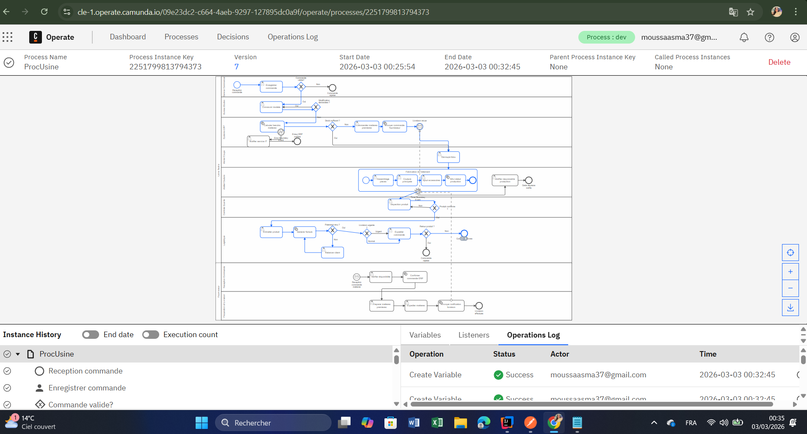

# 🏭 Textile Manufacturing Workflow — Camunda v8

> A Spring Boot BPM system automating the full textile manufacturing process using Camunda 8 and Zeebe, with inter-pool messaging, Error & Timer Boundary Events, and 5 operational Java workers.

**École Nationale d'Ingénieurs de Tunis — Module Workflow & BPMN 2025/2026**  
**Encadrante :** Mme Mariam Chaabane  
**Équipe :** Asma Moussa · Malek Ghanmi · Tayssir Bayoudh · Wassim Bsissa · Aziz Bouazzi

---

## 📋 Table of Contents

- [Description](#description)
- [Architecture](#architecture)
- [BPMN Process](#bpmn-process)
- [Prerequisites](#prerequisites)
- [Configuration](#configuration)
- [Running the Project](#running-the-project)
- [API Usage](#api-usage)
- [Testing](#testing)
- [Screenshots](#screenshots)
- [Technologies](#technologies)

---

## Description

This project models, deploys, and executes the complete garment manufacturing process in a textile industry using **BPMN 2.0** on **Camunda Platform 8**.

Key features:
- **18+ BPMN activities**, 7 gateways, 6 events
- **2 communicating pools**: Factory (ProcUsine) + Supplier (ProcFourn)
- **Error Boundary Event** — ERP failure handling
- **Timer Boundary Event** — production delay notifications
- **Inter-pool messaging** via Zeebe message correlation
- **13 Camunda forms** deployed on Tasklist
- **5 Zeebe Job Workers** across 2 Spring Boot applications

---

## Architecture

```
┌─────────────────┐         ┌──────────────────────────┐         ┌──────────────────────┐
│  Postman / curl │──POST──▶│   usine-client :8080      │──gRPC──▶│                      │
└─────────────────┘         │  calculate-material-needs │         │   Camunda v8 SaaS    │
                            │  generate-invoice         │         │   ──────────────────  │
                            │  update-production-status │◀──gRPC──│   Zeebe              │
                            └──────────────────────────┘         │   Operate            │
                                                                  │   Tasklist           │
                            ┌──────────────────────────┐         │                      │
                            │  fournisseur-client :8081 │──gRPC──▶│                      │
                            │  confirm-order-erp        │         └──────────────────────┘
                            │  send-delivery-notification│◀── LivraisonConfirmee message
                            └──────────────────────────┘
```

---

## BPMN Process

### Pool 1 — Usine Textile (ProcUsine)

```
[Reception commande]
        ↓
[Enregistrer commande]          ← User Task
        ↓
  <Commande valide ?>
  ├── Non  → [Commande rejetée]
  └── Oui  →
        ↓
[Concevoir modèle]              ← User Task
        ↓
  <Modification demandée ?>     ← boucle révision
        ↓
[Calculer besoins matières]     ← Service Task (calculate-material-needs)
   └── Error ERP → [Notifier service IT]
        ↓
  <Stock suffisant ?>
  ├── Oui → production directe
  └── Non → [Commander matières] → Message vers ProcFourn
        ↓
[Découpe tissu]                 ← User Task
        ↓
┌─ Sous-processus : Fabrication du vêtement ──────────────────┐
│  [Assemblage pièces] → [Couture principale]                  │
│  → [Ajout accessoires] → [MAJ statut production]            │
│  Timer Boundary Event → [Notifier responsable] si délai     │
└──────────────────────────────────────────────────────────────┘
        ↓
[Inspection produit]            ← User Task
        ↓
  <Produit conforme ?>
  ├── Non → retour fabrication
  └── Oui →
        ↓
[Emballer produit] → [Générer facture]  ← Service Task (generate-invoice)
        ↓
  <Paiement reçu ?>  → Non → [Relancer client]
        ↓
  <Livraison urgente ?>
        ↓
[Expédier commande] → [Message End Event : Commande livrée]
```

### Pool 2 — Fournisseur (ProcFourn)

```
[Message Start : CommandeMatieres]
        ↓
[Vérifier disponibilité] → [Confirmer commande ERP]
        ↓
[Préparer matières] → [Expédier matières]
        ↓
[Envoyer notification livraison]  ← publie "LivraisonConfirmee" → débloque ProcUsine
        ↓
[End Event : Livraison effectuée]
```

---

## Prerequisites

- **Java JDK 21+**
- **Maven 3.8+**
- **Camunda 8 SaaS account** (cluster `cle-1`)
- **Postman** or `curl` for API calls

---

## Configuration

### ⚠️ Security — Use Environment Variables

Never commit credentials in plain text. Replace values in `application.properties` with:

```properties
# usine-client/src/main/resources/application.properties
zeebe.client.cloud.clusterId=${ZEEBE_CLUSTER_ID}
zeebe.client.cloud.clientId=${ZEEBE_CLIENT_ID}
zeebe.client.cloud.clientSecret=${ZEEBE_CLIENT_SECRET}
zeebe.client.cloud.region=${ZEEBE_REGION}
server.port=8080
```

```properties
# fournisseur-client/src/main/resources/application.properties
zeebe.client.cloud.clusterId=${ZEEBE_CLUSTER_ID}
zeebe.client.cloud.clientId=${ZEEBE_CLIENT_ID}
zeebe.client.cloud.clientSecret=${ZEEBE_CLIENT_SECRET}
zeebe.client.cloud.region=${ZEEBE_REGION}
server.port=8081
```

Set environment variables before running:

```bash
export ZEEBE_CLUSTER_ID=your-cluster-id
export ZEEBE_CLIENT_ID=your-client-id
export ZEEBE_CLIENT_SECRET=your-client-secret
export ZEEBE_REGION=cle-1
```

### Camunda SaaS URLs

| Service  | URL |
|----------|-----|
| Operate  | `https://cle-1.operate.camunda.io/<your-cluster-id>` |
| Tasklist | `https://cle-1.tasklist.camunda.io/<your-cluster-id>` |

---

## Running the Project

### Terminal 1 — Usine client (port 8080)

```bash
cd usine-client
mvn clean install
mvn spring-boot:run
```

### Terminal 2 — Fournisseur client (port 8081)

```bash
cd fournisseur-client
mvn clean install
mvn spring-boot:run
```

---

## API Usage

### Start a process instance

```bash
curl -X POST http://localhost:8080/api/usine/start \
  -H "Content-Type: application/json" \
  -d '{
    "numeroCommande": "CMD-001",
    "nomClient":      "Asma Moussa",
    "emailClient":    "asma@enit.tn",
    "typeVetement":   "Veste",
    "typeTissu":      "coton",
    "quantite":       10,
    "priorite":       "normale"
  }'
```

### Expected response

```json
{
  "processInstanceKey": "2251799813685775",
  "status": "STARTED",
  "numeroCommande": "CMD-001"
}
```

---

## Testing

### Test 1 — Normal flow (stock sufficient)

```bash
curl -X POST http://localhost:8080/api/usine/start \
  -d '{ "numeroCommande": "CMD-001", "quantite": 5, "typeTissu": "coton", ... }'
```
✅ Process goes directly to production (`stock = true`)

---

### Test 2 — Stock insufficient → inter-pool communication

```bash
curl -X POST http://localhost:8080/api/usine/start \
  -d '{ "numeroCommande": "CMD-002", "quantite": 200, "typeTissu": "laine", ... }'
```
✅ `calculate-material-needs` returns `stock=false`  
✅ Message `CommandeMatieres` sent to ProcFourn  
✅ ProcFourn starts, confirms order, publishes `LivraisonConfirmee`  
✅ ProcUsine unblocked and continues  

---

### Test 3 — ERP Error Boundary Event

In `ErpService.java`, set:
```java
private static final boolean ERP_DISPONIBLE = false;
```
✅ Worker throws `ZeebeBpmnError("ERP_ERROR", ...)`  
✅ Error Boundary Event triggers  
✅ Flow redirected to "Notifier service IT"  

---

### Test 4 — Automatic payment (urgent priority)

```bash
curl -X POST http://localhost:8080/api/usine/start \
  -d '{ ..., "priorite": "urgente" }'
```
✅ `paiement=true` set automatically  
✅ GW4 routes directly to shipping without client relance  

---

### Test Results Summary

| # | Scenario | Status |
|---|----------|--------|
| T1 | Stock sufficient | ✅ OK |
| T2 | Stock insufficient + inter-pool message | ✅ OK |
| T3 | LivraisonConfirmee received, ProcUsine unblocked | ✅ OK |
| T4 | Invoice generated (FAC-FE33FC4E, 9000 EUR) | ✅ OK |
| T5 | Payment confirmed, process continues to shipping | ✅ OK |
| T6 | ERP Error Boundary Event triggered, IT notified | ✅ OK |

---

## Screenshots

### ProcUsine — Process running in Camunda Operate


### ProcUsine — Process completed


### ProcFourn — Supplier inter-pool communication


### Operations Log — Variables created successfully


---

## Project Structure

```
textile-workflow-camunda/
├── usine-client/                        # Spring Boot app — port 8080
│   └── src/main/java/com/textile/usine/
│       ├── controller/
│       │   └── StartUsineController.java
│       ├── workers/
│       │   ├── CalculerBesoinsWorker.java
│       │   ├── GenererFactureWorker.java
│       │   └── MajStatutProductionWorker.java
│       ├── services/
│       │   ├── ErpService.java
│       │   ├── StockService.java
│       │   └── FactureService.java
│       └── UsineApplication.java
├── fournisseur-client/                  # Spring Boot app — port 8081
│   └── src/main/java/com/textile/fournisseur/
│       ├── workers/
│       │   ├── ConfirmerCommandeErpWorker.java
│       │   └── EnvoyerNotificationLivraisonWorker.java
│       ├── services/
│       │   └── NotificationService.java
│       └── FournisseurApplication.java
├── forms/                               # Camunda forms (.form)
│   ├── form-enregistrer-commande.form
│   ├── form-concevoir-modele.form
│   ├── form-commander-matieres.form
│   ├── form-decoupe-tissu.form
│   ├── form-assemblage-pieces.form
│   ├── form-couture-principale.form
│   ├── form-ajout-accessoires.form
│   ├── form-inspection-produit.form
│   ├── form-emballer-produit.form
│   ├── form-expedier-commande.form
│   ├── form-relancer-client.form
│   ├── form-notifier-responsable.form
│   └── form-notifier-service-it.form
├── bpmn/                                # BPMN diagram files
├── assets/                              # Screenshots
│   ├── test-procusine-running.png
│   ├── test-procusine-completed.png
│   ├── test-procfourn-completed.png
│   └── test-procusine-operations-log.png
├── rapport/                             # Project report (PDF)
├── .gitignore
└── README.md
```

---

## Technologies

| Technology | Version | Role |
|---|---|---|
| Camunda Platform | 8.9.0-alpha4 | BPM engine, Zeebe, Operate, Tasklist |
| Java JDK | 21 | Workers implementation language |
| Spring Boot + Zeebe SDK | 8.5.3 | Camunda Spring integration |
| Maven | 3.8+ | Dependency management |
| Camunda Web Modeler | SaaS | BPMN modeling & form design |
| Postman | Latest | REST endpoint testing |

---

## BPMN Constraints Verification

| Element | Required | Implemented |
|---|---|---|
| Activities | 15 min | ✅ 18+ |
| Gateways | 7 | ✅ 7 (GW1–GW7) |
| Events | 5 min | ✅ 6 |
| Timer Boundary Event | 1 | ✅ 1 |
| Error Boundary Event | 1 | ✅ 1 |
| Sub-process | 1 | ✅ 1 (Fabrication) |
| Pools & Lanes | Yes | ✅ 2 pools, 9 lanes |
| Inter-pool communication | Yes | ✅ Zeebe messages |

---

*Module Workflow & BPMN — ENIT 2025/2026*